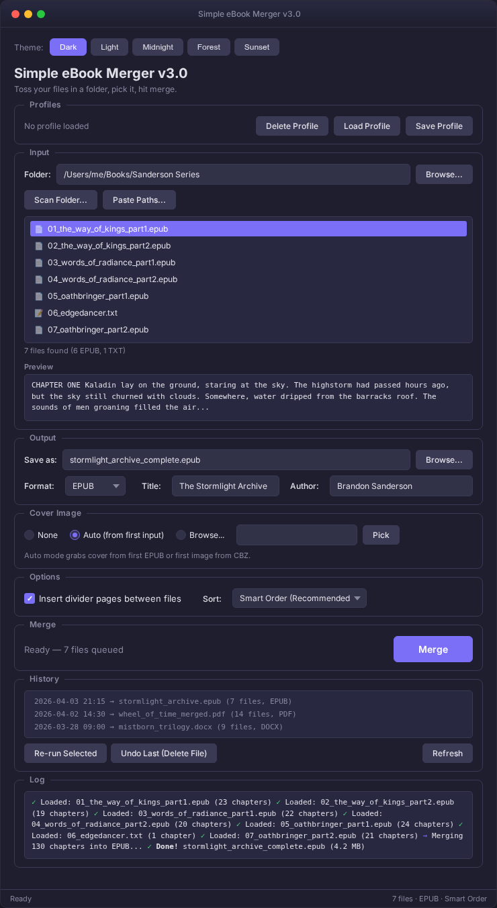
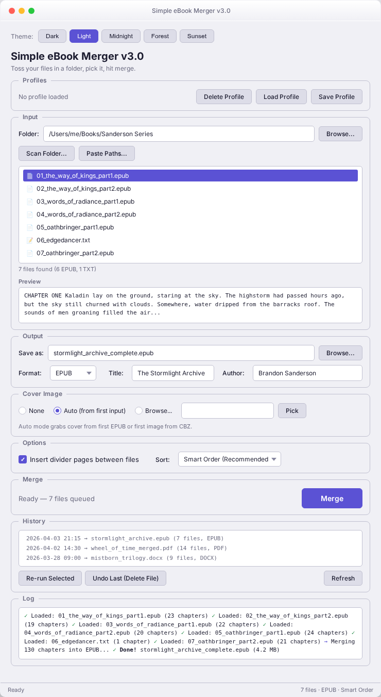
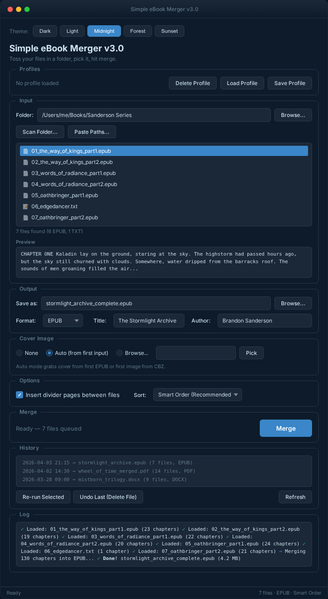
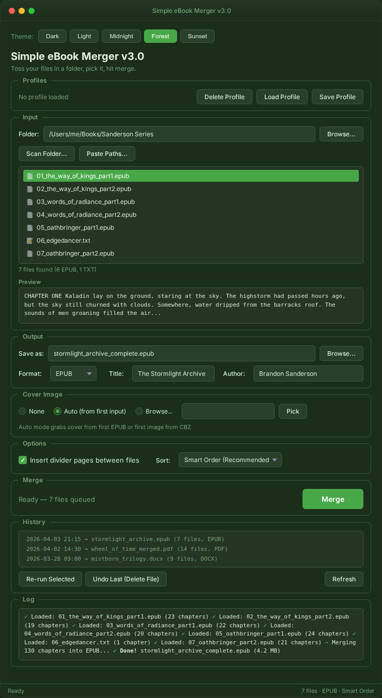
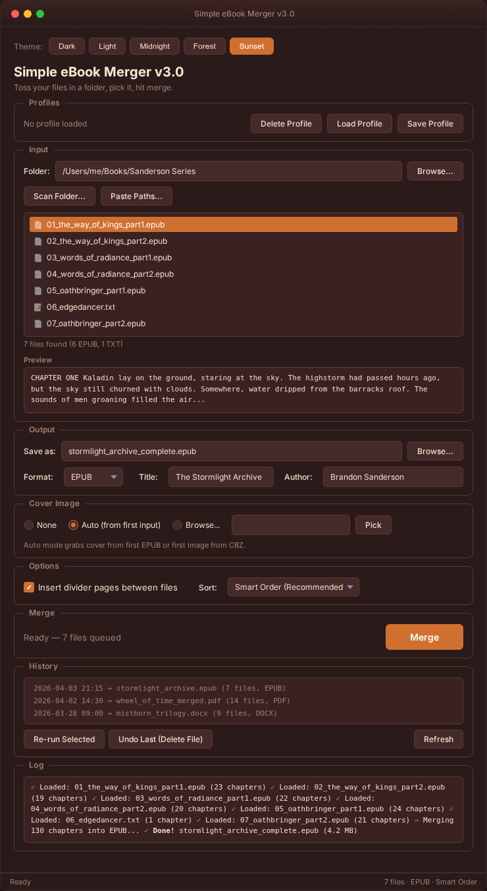

# Simple eBook Merger

Merge a bunch of eBook files into one output file. Supports 11 input formats and 5 output formats. That's it.

I wrote this because I was sick of dealing with 20+ individual chapter files on my eReader every time an author publishes a series in parts. Now I just dump them all in a folder and run this.

Supports **EPUB**, **TXT**, **HTML**, **PDF**, **DOCX**, **RTF**, **Markdown**, **FB2**, **ODT**, and **CBZ** inputs. Output as **EPUB**, **TXT**, **HTML**, **PDF**, or **DOCX**.

================================================================================

## Screenshots



================================================================================

## Requirements

- **Python 3.8+** — grab it from https://python.org/downloads
  - During install, check "Add Python to PATH" (important!)
- **tkinter** — ships with Python on Windows and Mac. Linux users might need `sudo apt install python3-tk`.

**Required** (must install):

```
pip install ebooklib beautifulsoup4 lxml
```

**Optional** (install whichever you need — the tool tells you what's missing):

```
pip install pypdf          # PDF input support
pip install python-docx    # DOCX input/output support
pip install odfpy          # ODT input support
pip install fpdf2          # PDF output support
pip install Pillow         # CBZ (comic book) input + cover images
```

Or just install everything at once:

```
pip install ebooklib beautifulsoup4 lxml pypdf python-docx odfpy fpdf2 Pillow
```

RTF and Markdown support is built in — no extra installs needed.

================================================================================

## How to Use

### Option A — GUI (default, recommended)

Double-click `ebook_merger.py` or run:

```
python ebook_merger.py
```

A window opens. Here's the rundown:

1. **Pick your input folder** — click Browse or use Scan Folder to dig through subdirectories
2. **Preview chapters** — click any file in the list to see the first few lines in the Preview panel
3. **Set your output** — pick format, filename, title, author
4. **Optionally add a cover image** — pick one manually, or let it auto-pull from your first EPUB/CBZ
5. **Hit Merge** — done

The GUI shows a live log as it works. When it's finished you get a summary with file size and chapter count.

### Option B — Terminal / headless

If you're on a server without a display, or you just prefer the command line:

```
python ebook_merger.py --nogui
```

In this mode you'll need to edit the `CONFIG` section near the top of the script first:

```python
INPUT_DIR     = r"C:\Users\You\Documents\my_series"
OUTPUT_FILE   = "merged_book.epub"
BOOK_TITLE    = "My Merged eBook"
BOOK_AUTHOR   = "Various Authors"
ADD_DIVIDERS  = True
OUTPUT_FORMAT = "epub"
```

Then just run it.

================================================================================

## Features

### File Input
- **Folder browser** — pick a folder and it grabs every supported file inside
- **Scan Folder** — recursively search through subfolders, then pick which files to add
- **Paste Paths** — paste a list of file paths (one per line) to quick-add files from anywhere on your system

### Cover Image
Set a cover for your merged book:
- **None** — skip the cover
- **Auto** — pulls the cover from your first EPUB, or the first image from a CBZ
- **Browse** — pick any image file (PNG, JPG, BMP, GIF, WEBP)

Works with EPUB, PDF, DOCX, and HTML output. (TXT doesn't support images, obviously.)

### Chapter Preview
Click any file in the list and the Preview panel shows the first ~500 characters. Handy for checking if your files are in the right order before you merge.

### Smart Chapter Ordering
Pick how files get sorted before merging:
- **Smart Order** (default) — auto-detects numbered prefixes, roman numerals, series patterns, dates
- **Alphabetical** — plain A-Z by filename
- **Natural Sort** — handles numbers in filenames correctly (chapter2 before chapter10)
- **None** — whatever order the OS gives them

### Profiles
Save your merge settings so you don't have to reconfigure everything for recurring jobs.

GUI has Save/Load/Delete buttons. From the terminal:

```
python ebook_merger.py --save-profile "My Series"
python ebook_merger.py --profile "My Series"
python ebook_merger.py --list-profiles
```

Profiles are stored as JSON in `~/.ebook_merger/profiles/`.

### Merge History
Every merge gets logged to `~/.ebook_merger/history.json`. The History section in the GUI shows your last 20 merges. You can:
- **Re-run** a previous merge with the same settings
- **Undo** the last merge (deletes the output file, asks first)

### Themes
Five color themes: **Dark**, **Light**, **Midnight**, **Forest**, **Sunset**. Switch from the buttons at the top of the window. Your pick is remembered between sessions.

================================================================================

## Supported Input Formats

| Format | Extension | What happens |
|---|---|---|
| EPUB | .epub | Chapters, formatting, and images are all preserved |
| Plain Text | .txt | Turned into a single chapter with paragraph formatting |
| HTML | .html, .htm | Turned into a chapter, formatting preserved |
| PDF | .pdf | Text extracted from each page, combined into a chapter |
| Word (DOCX) | .docx | Paragraphs extracted with basic formatting (bold, italic, headings) |
| RTF | .rtf | RTF tags stripped, plain text wrapped into HTML |
| Markdown | .md | Converted to HTML, then treated like HTML input |
| FictionBook | .fb2 | XML parsed, sections and paragraphs extracted |
| OpenDocument | .odt | Text and paragraphs extracted |
| Comic Book | .cbz | Images extracted from the zip, each becomes a page |

Anything else in the folder gets skipped automatically — it won't break anything.

## Supported Output Formats

| Format | Extension | Notes |
|---|---|---|
| EPUB | .epub | EPUB 3 — the default, works everywhere |
| Plain Text | .txt | All HTML stripped, chapters separated by dividers |
| HTML | .html | Single styled HTML file with all chapters |
| PDF | .pdf | Basic formatted PDF document |
| Word (DOCX) | .docx | Word document with chapter headings |

Some output formats need optional dependencies. The GUI grays out anything that's not available and tells you what to install.

================================================================================

## Tips

- **Control the merge order** by naming your files with number prefixes: `01_prologue.epub`, `02_chapter1.epub`, `03_chapter2.txt`, etc. Or use Smart Order and let the tool figure it out.
- **Divider pages** are inserted between each source file by default, so you can tell where one ends and the next starts. You can turn this off in the GUI (uncheck the box) or by setting `ADD_DIVIDERS = False` in the config.
- **Images** from EPUB and CBZ files carry over into the merged output.
- **Table of contents** is auto-generated. Multi-chapter EPUBs get nested entries.
- The default output is **EPUB 3**, which works with pretty much everything: Calibre, Apple Books, Kobo, Rockbox, Kindle (via Send to Kindle or Calibre conversion), you name it.
- **Optional deps are optional** — you only need `ebooklib`, `beautifulsoup4`, and `lxml` to run the tool. Everything else adds support for specific formats. The GUI tells you what's missing.

================================================================================

## Config Reference (terminal mode only)

The GUI handles all of this through the window. These settings only matter if you run with `--nogui`.

| Setting | What it does | Example |
|---|---|---|
| INPUT_DIR | Folder with your eBook files | `r"C:\Users\You\ebooks"` |
| OUTPUT_FILE | Where to save the merged file | `"merged_book.epub"` |
| BOOK_TITLE | Title in the output metadata | `"My Merged eBook"` |
| BOOK_AUTHOR | Author in the output metadata | `"Various Authors"` |
| ADD_DIVIDERS | Put a divider page between each file | `True` |
| OUTPUT_FORMAT | Output file format | `"epub"`, `"txt"`, `"html"`, `"pdf"`, `"docx"` |

================================================================================

## Legal Disclaimer

By downloading, viewing, thinking about, dreaming about, or otherwise interacting with this software — including staring at it real hard — you agree to the following.

### Personal Use Only

This is for merging ebook files **you already own** into one file for **your own eyeballs.** That's it. If you use it for literally anything else, that's a you problem, not a me problem.

### Copyright — Don't Be That Guy

The stuff you merge is almost certainly copyrighted. You may NOT:

- Share, upload, email, fax, telegraph, or send via carrier pigeon the output
- Sell it, trade it, barter it for goats, or monetize it in any way
- Post it online anywhere — not even "just for friends," not even on a private Discord
- Use it for AI training or data mining

### Absolutely Zero Warranty

This software is provided "AS IS" and "AS AVAILABLE" and "WITH ALL FAULTS" and "GOOD LUCK" — without warranty of any kind, express, implied, spiritual, or interdimensional, including warranties of merchantability, fitness for a particular purpose, or the warranty that it won't set your computer on fire (it won't, probably, but legally I make no promises). I tested it. It works on my machine.

### Limitation of Liability — The Big One

To the maximum extent permitted by every law that has ever been written, is currently being written, or will be written in the future by any governing body on Earth, in space, or on any celestial body that may eventually be colonized: **I am not liable for anything.** Not your files, not your computer, not your cat walking across the keyboard, not lost data, not emotional distress from a bad chapter break, not acts of God, acts of Congress, or acts of sheer stupidity. My total liability across all claims is **$0.00 USD.** You paid nothing. You get nothing back.

### Indemnification — You Protect Me

If someone comes after me because of something you did with this script, you agree to pay all my legal fees, defend me in court (bring snacks), and cover any damages. This applies even if I somehow contributed by writing a script that works too well.

### Your Responsibility

You bear sole, complete, absolute, no-takebacks responsibility for everything you do with this. "I didn't read the disclaimer" is not a defense. "My dog did it" is also not a defense.

### Severability

If any part of this is found unenforceable, the rest still stands. You don't get to throw out the whole thing because one clause was too spicy.

### Governing Law

Governed by the laws of whatever jurisdiction the author resides in at the time of the dispute — and no, I'm not telling you where that is. If there's a conflict, it gets resolved wherever I feel like filing. Good luck with that.

### Support the Authors

I built this so reading is more convenient, not so people can rip off writers. If you're merging chapters from a series you love, make sure you actually paid for it. Authors have rent to pay. Buy their stuff. Leave nice reviews. Don't be the reason they quit.

================================================================================

## License

Released for personal use. See the disclaimer above (seriously, read it — it's actually pretty funny).
I don't claim ownership over anything this script processes.

================================================================================

## Other Themes

Five built-in themes — switches instantly and remembers your choice.

| Light | Midnight | Forest | Sunset |
|---|---|---|---|
|  |  |  |  |
